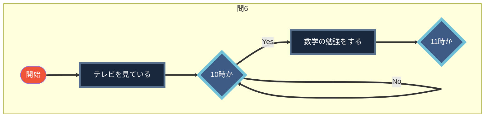
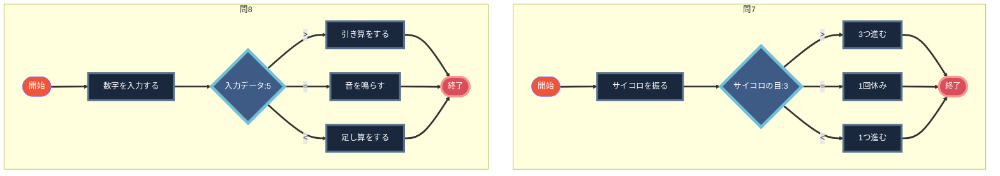
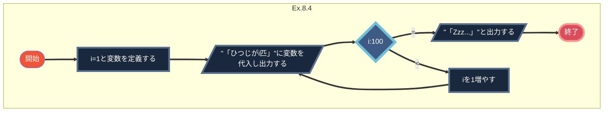
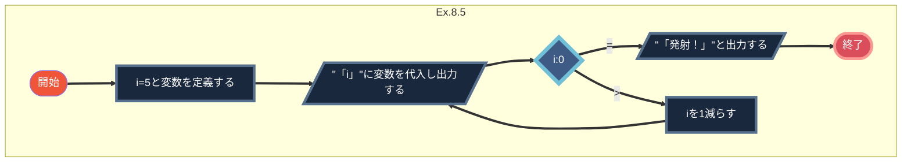
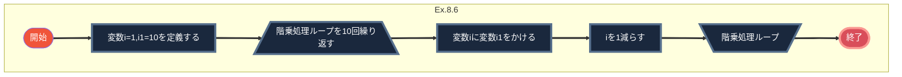

# 概要

この課題は、有償ソフトウェアTyporaに搭載されているMermaid機能を利用して作成した。

Typoraを使用しなくても次のウェブサイトでMermaidを使用することが可能。

https://mermaid-js.github.io/mermaid-live-editor

# 問6

```mermaid
graph TD
	subgraph 問6
    A([開始]):::Start ==>B[テレビを見ている]
    B:::Operation ==> C{10時か}
    C:::Switch ==>|Yes| D[数学の勉強をする]:::Operation ==> E{11時か}:::Switch
    C ==>| No | C
    end
classDef Label fill:##f0553a,color:white
classDef Start fill:#f0553a,color:white
classDef Operation fill:#1a283d,stroke:#57708d,color:white,stroke-width:4px
classDef Switch fill:#3e5b85,stroke:#70c0d8,color:white,stroke-width:6px
classDef End fill:#d94e5a,stroke:#fa9891,color:white,stroke-width:4px
```

# 問7,8

```mermaid
graph TD
	subgraph 問7
	A([開始]):::Start ==>B[サイコロを振る]
    B:::Operation ==> C{サイコロの目:3}
    C:::Switch ==>| > | D[3つ進む]:::Operation ==> G([終了])
    C ==>| = | E[1回休み]:::Operation ==> G
    C ==>| < | F[1つ進む]:::Operation ==> G:::End
    end
    subgraph 問8
    A1([開始]):::Start ==>B1[数字を入力する]
    B1:::Operation ==> C1{入力データ:5}
    C1:::Switch ==>| > | D1[引き算をする]:::Operation ==> G1([終了])
    C1 ==>| = | E1[音を鳴らす]:::Operation ==> G1
    C1 ==>| < | F1[足し算をする]:::Operation ==> G1:::End
    end
classDef Start fill:#f0553a,color:white
classDef Operation fill:#1a283d,stroke:#57708d,color:white,stroke-width:4px
classDef Switch fill:#3e5b85,stroke:#70c0d8,color:white,stroke-width:6px
classDef End fill:#d94e5a,stroke:#fa9891,color:white,stroke-width:4px
```

# Ex.8.4

```mermaid
graph TD
    subgraph Ex.8.4
    A1([開始]):::Start ==>B1[i=1と変数を定義する]
    B1:::Operation ==> C1[/&quot&#x300cひつじがi匹&#x300d&quotに変数を代入し出力する/]:::Operation
    C1 ==> C2{i:100}:::Switch
    C2 ==>| = |E1
    C2 ==>| < |D1
    D1[iを1増やす]:::Operation ==>C1
    E1[/&quot&#x300cZzz...&#x300d&quotと出力する/]:::Operation ==> G1([終了]):::End
	end
classDef Start fill:#f0553a,color:white
classDef Operation fill:#1a283d,stroke:#57708d,color:white,stroke-width:4px
classDef Switch fill:#3e5b85,stroke:#70c0d8,color:white,stroke-width:6px
classDef End fill:#d94e5a,stroke:#fa9891,color:white,stroke-width:4px
```

# Ex.8.5

```mermaid
graph TD
    subgraph Ex.8.5
    A1([開始]):::Start ==>B1[i=5と変数を定義する]
    B1:::Operation ==> C1[/&quot&#x300ci&#x300d&quotに変数を代入し出力する/]:::Operation
    C1 ==> C2{i:0}:::Switch
    C2 ==>| = |E1
    C2 ==>| > |D1
    D1[iを1減らす]:::Operation ==>C1
    E1[/&quot&#x300c発射&#xff01&#x300d&quotと出力する/]:::Operation ==> G1([終了]):::End
	end
classDef Start fill:#f0553a,color:white
classDef Operation fill:#1a283d,stroke:#57708d,color:white,stroke-width:4px
classDef Switch fill:#3e5b85,stroke:#70c0d8,color:white,stroke-width:6px
classDef End fill:#d94e5a,stroke:#fa9891,color:white,stroke-width:4px
```

# Ex.8.6

```mermaid

graph TD
    subgraph Ex.8.6
    A1([開始]):::Start ==>B1[変数i=1,i1=10を定義する]:::Operation
    B1==> C1[/階乗処理ループを10回繰り返す\]:::Operation
    C1 ==> C2[変数iに変数i1をかける]:::Operation
    C2 ==>D1[iを1減らす]:::Operation==>E1
    E1[\階乗処理ループ/]:::Operation ==> G1([終了]):::End
	end
classDef Start fill:#f0553a,color:white
classDef Operation fill:#1a283d,stroke:#57708d,color:white,stroke-width:4px
classDef Switch fill:#3e5b85,stroke:#70c0d8,color:white,stroke-width:6px
classDef End fill:#d94e5a,stroke:#fa9891,color:white,stroke-width:4px
```

