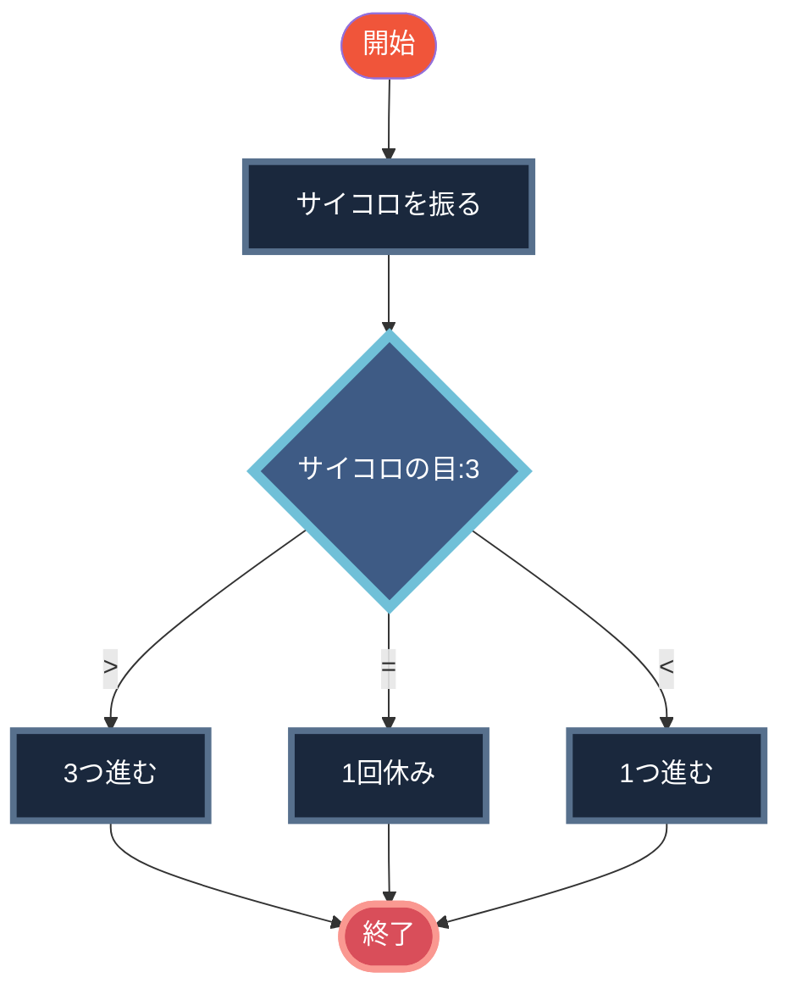

```mermaid
graph:::Star TD
A([開始]):::Start -->B[サイコロを振る]
B:::Operation --> C{サイコロの目:3}
C:::Switch -->| > | D[3つ進む]:::Operation --> G([終了])
C -->| = | E[1回休み]:::Operation --> G
C -->| < | F[1つ進む]:::Operation --> G:::End
classDef Start fill:#f0553a,color:white
classDef Operation fill:#1a283d,stroke:#57708d,color:white,stroke-width:4px
classDef Switch fill:#3e5b85,stroke:#70c0d8,color:white,stroke-width:6px
classDef End fill:#d94e5a,stroke:#fa9891,color:white,stroke-width:4px
```


